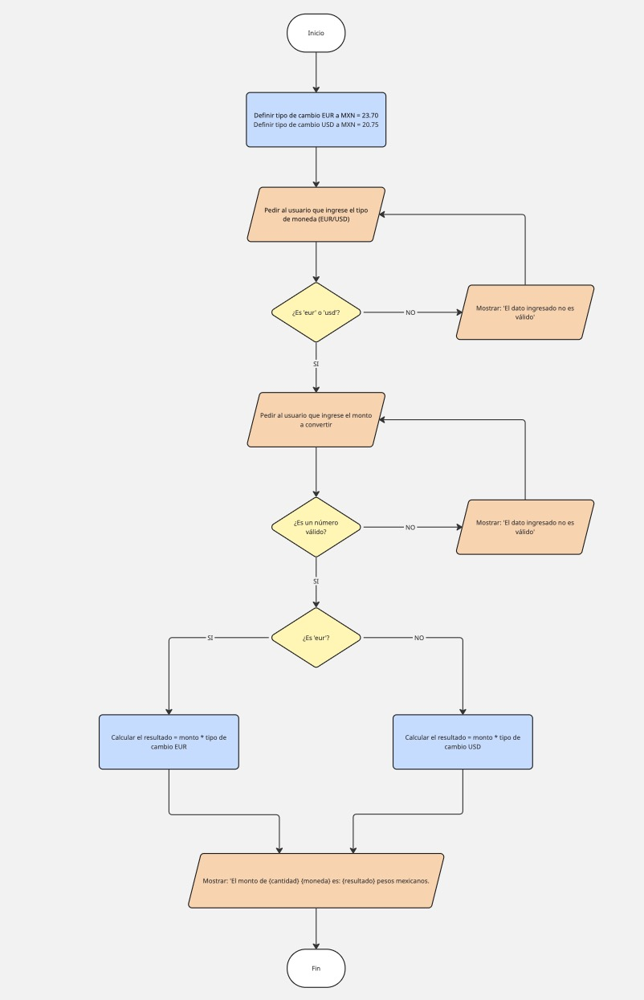

# conversion-moneda
Solución a problemática de empresa ficticia donde se realiza un programa de conversión de moneda EUR-MXN y USD-MXN

## PROBLEMÁTICA
"La empresa mexicana SuperTech está perdiendo dinero porque en las transacciones desde moneda internacional
hay muchos errores del personal al realizar cálculos a mano para pasar de Euro a Peso Mexicano y Dólar a Peso Mexicano
en los pagos de importaciones"

## Diagrama de flujo

